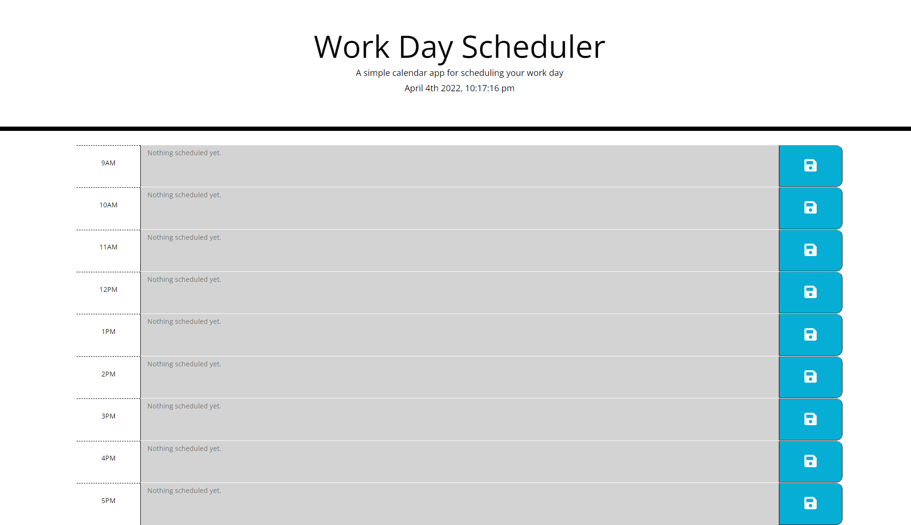

# Work-day Scheduler

  
## Description

A web app that allows users to save events at each hour of a work-day to track their daily schedule. Users can type their tasks in the input box and hit save to set the task for that hour. Scheduled tasks persist upon page reload unless localstorage is cleared and are limited to a user's browser.

[Deployment](https://realnifty.github.io/workday-scheduler/)

## Table of Contents

- [Technologies](#technologies)
- [Installation](#installation)
- [License](#license)
- [Contributing](#contributing)
- [Tests](#tests)
- [Questions](#questions)

## Technologies

This app was built with:
- HTML
- CSS
- JavaScript(jQuery)

## Installation

No installation required! Simply navigate to the deployment via link provided above. To run locally, clone the repository to your local machine and open with your preferred browser.

## License
    
Licensed under the [MIT License](https://spdx.org/licenses/MIT.html)

## Contributing

No contributions will be accepted at this time.

## Tests

No testing is planned for this project at this time.

## Questions

Have questions? Reach me at the following sources!

* GitHub: [realnifty](https://github.com/realnifty)
* E-mail: rogelioalbertopedraza@gmail.com or lovecore@pm.me